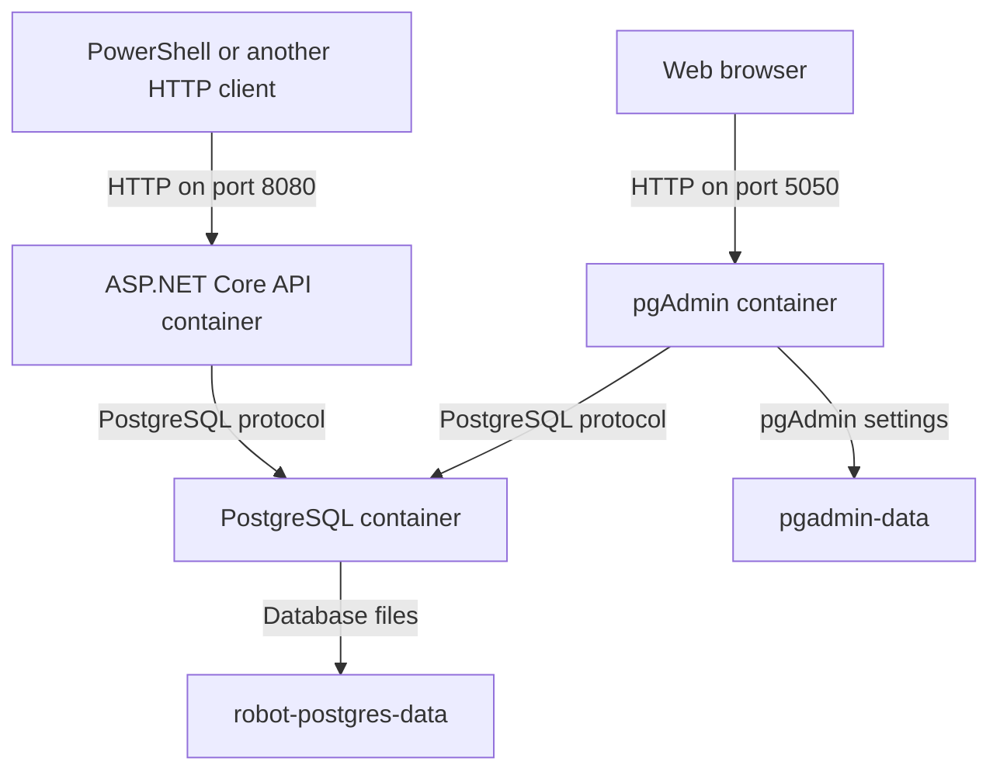
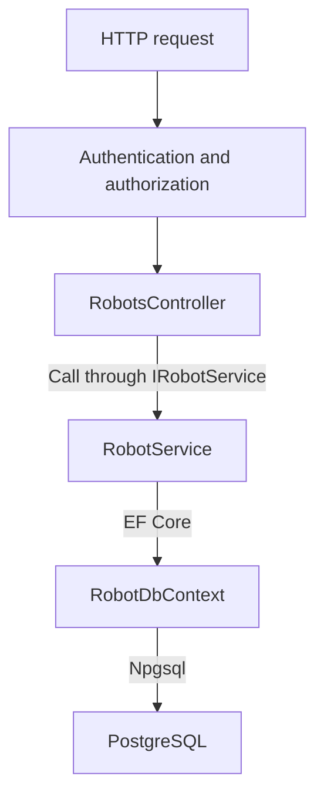

# Architecture Review

## Part 1 – How the system works today

RobotMaintenanceAPI is a REST API that receives "requests" about robots. It uses PostgreSQL to store robot data. Docker Compose starts the parts needed to run the project locally.

### Where do the parts run?

Docker Compose starts **three containers** on an internal network. The API is built from this project's `Dockerfile`. PostgreSQL stores the robots. pgAdmin is an optional tool for looking at the database in a browser; normal API requests do not go through pgAdmin. From our computer, we can reach the API on port `8080`, pgAdmin on `5050`, and PostgreSQL on `5432`. Inside the Docker network, the API and pgAdmin reach the database at `postgres:5432`.

| Part | What does it do? | What does it depend on? |
|---|---|---|
| HTTP client | Sends requests to the API and includes a JWT for protected routes. PowerShell is one example. | A reachable API and a valid token created outside this project. |
| API | Responds to HTTP requests, checks tokens, runs robot operations, and applies database migrations at startup. | PostgreSQL, a connection string, and token validation settings for protected routes. |
| PostgreSQL | Stores the `Robots` table and sample robots. | Its Docker volume, which keeps the data when containers are recreated. |
| pgAdmin | Lets us inspect the database through a browser. | PostgreSQL. The API does not depend on pgAdmin. |

There's no separate "frontend", login service, or process that talks to physical, *actual* robots in this repository.

### What happens inside the API?

`RobotsController`, `RobotService`, and `RobotDbContext` are **classes in the same API program**. The arrows between them are ordinary calls inside the program, not network traffic between separate containers. The request crosses into another container when `RobotDbContext` uses Npgsql to talk to PostgreSQL.

- `Program.cs` sets up authentication, the database connection, and dependency injection. For example, ASP.NET Core can give the controller an `IRobotService`, and give the service a `RobotDbContext`.
- `RobotsController` handles `GET /api/robots`, `GET /api/robots/{id}`, and `POST /api/robots`. It reads request parameters, checks input, and chooses HTTP responses.
- `IRobotService` is a C# interface describing the operations the service offers. It is not a separate server.
- `RobotService` performs those operations and uses the owner ID when it searches for or saves robots.
- `RobotDbContext` lets EF Core connect `Robot` objects in C# to data in PostgreSQL.
- `AuthController` provides `/api/auth/claims` to show information from an already accepted token. It does not actually log the users in.

### How does the API identify the user?

The client sends a JWT in the `Authorization: Bearer <token>` header. We can think of the token as an ID card containing information about the user. The API **validates** the token, but this project has no login endpoint and does not create tokens itself. Both controllers have `[Authorize]`.

`RobotsController` reads a claim named `sub` (subject) from the token and uses its value as the owner ID. `MapInboundClaims = false` keeps that claim name as `sub` so the controller can find it. If the claim is missing, the robot routes reject the request. When someone creates a robot, the service takes its owner from the token, not from an owner ID supplied by the client.

The local Development configuration contains settings for tokens made with `dotnet user-jwts`. The Compose setup does not include a token issuer or a complete production login system. We are describing how the API *uses* a valid identity, not claiming that the project has a complete user system.

### Example: A user requests a robot

Suppose the client requests `GET /api/robots/2` with a valid token where `sub = User A`. Robot 2, Hammer, is stored with `OwnerId = User B`.

1. ASP.NET Core checks the token and the authorization requirement.
2. `RobotsController` reads `User A` from `sub` and asks the service for robot 2 owned by that user.
3. `RobotService` asks the database for a robot where **both** `Id = 2` and `OwnerId = User A`.
4. No row matches because Hammer belongs to `User B`. The controller returns `404 Not Found`.

For `GET /api/robots`, the service also filters by `OwnerId`; it can additionally filter by status and return a specific page of results. For `POST /api/robots`, the controller validates the request and the service saves the robot with the owner from the token. Having a valid token therefore does not give someone access to every robot.

### Where is data stored, and what happens at startup?

`RobotDbContext` uses EF Core and Npgsql to read and write robot data in PostgreSQL. The database files live in the `robot-postgres-data` Docker volume. This is why the data survives an API container restart. pgAdmin has a separate volume for its own settings.

Compose waits for PostgreSQL's `pg_isready` health check before starting the API. `Program.cs` reads `ConnectionStrings:RobotDatabase` and applies pending EF Core migrations with `MigrateAsync()` before accepting requests. The first migration creates the table and sample robots; a later migration adds `OwnerId`.

`/health` reports that the API health check responds. PostgreSQL has a separate health check in Compose. OpenAPI and Swagger UI are available only when the API runs in the Development environment. Compose does not set Development by default.

**So in short:** Client → API → controller → service → EF Core → PostgreSQL → Docker volume. The JWT identifies who is asking. The `OwnerId` condition in the database query controls which robots that person can see.

## Some findings

### 1. Credentials in the committed Compose configuration

- **Problem:** `docker-compose.yaml` contained literal PostgreSQL and pgAdmin passwords, including the database password inside the API connection string. The README repeated the credentials as well.

- **Consequence:** Everyone who can read the repository can read and reuse those values. The risk grows if this local setup is copied to another environment or the passwords are reused.

- **Solution:** Require locally supplied values for Compose interpolation, keep `.env` ignored, and provide `.env.example` with placeholders. Use an appropriate "secrets mechanism" if deploying beyond this local exercise.

- **Priority:** Medium for now, but high before using the same setup with real data or outside a trusted machine.

### 2. Automatic migrations during API startup

- **Problem:** `Program.cs` calls `MigrateAsync()` on every startup.

- **Consequence:** Starting the API requires a reachable database and a database user with permission to change its schema. A failed migration prevents the start of the API, and coordinating multiple API instances would require more care.

- **Solution:** Keep the convenience for local development, but run migrations as a deliberate deployment step before starting API instances in a larger deployment.

- **Priority:** Medium; becomes a lot more urgent when deploying multiple instances or tightening database permissions.

### 3. Robot status rules live in one HTTP action

- **Problem:** `RobotsController.CreateRobot` owns the list of allowed status strings, while `RobotService` and the `Robot` model accept arbitrary strings.

- **Consequence:** A future endpoint or caller of the service *could* store an "invalid status" unless it duplicates the controller check. The rule could then diverge between entry points.

- **Solution:** Define the allowed statuses once in a shared domain type or validation component and have all creation and update paths use it.

- **Priority:** Medium; will likely address it before adding more ways to change robot status.

## Chosen improvement

Finding 1 is implemented in `docker-compose.yaml` and `.env.example`. The comparison and trade-offs are recorded in [adr.md](adr.md). This does not remove previously committed "demo" credentials from Git history; any password reused elsewhere must be changed there.